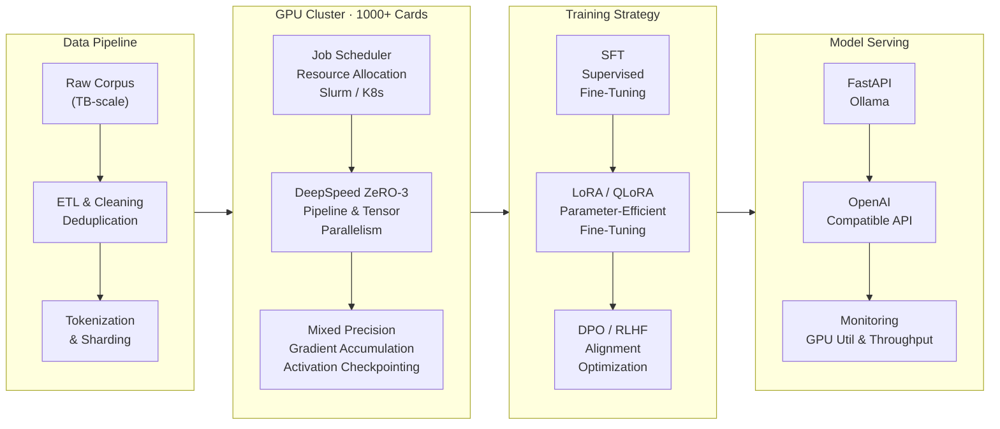

## Abstract

<!-- Trophy Wall -->

  

<!-- Streak Stats -->

  

<!-- GitHub Stats -->

  

<!-- Activity Graph -->

  

<!-- Tech Stack -->

  
   
  

---

## AI Infra & Distributed Training

  
  
  
  
  

  <i>End-to-end LLM training pipeline: from TB-scale data preprocessing to distributed training across 1000+ GPU cluster, through alignment optimization, to production model serving.</i>

---

## Top Projects

| Project | Description | Stars |
|:--|:--|:--|
| [prompt-optimizer-lite](https://github.com/Lab-Overflow/prompt-optimizer-lite) | Lightweight prompt optimization toolkit | `262 ⭐` |

## Tech Focus

**AI Agent & Multi-Agent**
`LangChain` `LangGraph` `Dify` `MCP Protocol` `ReAct` `Function Calling` `Prompt Engineering` `Context Engineering` `Agentic Automation` `Multi-Agent Orchestration`

**RAG & Intelligent Query**
`Text2SQL` `NL2SQL` `NL2Data` `Vector Retrieval` `Hybrid Retrieval` `Query Rewrite` `Knowledge Base` `ETL Pipeline` `Structured Output` `JSON Schema`

**AI Infra & Model Engineering**
`PyTorch` `Transformers` `LoRA` `QLoRA` `SFT` `DPO` `DeepSpeed` `Distributed Training` `Mixed Precision` `Gradient Checkpointing` `Ollama` `OpenAI Compatible API` `Model Serving`

**Fullstack & DevOps**
`React` `TypeScript` `FastAPI` `Node.js` `Three.js` `WebGL` `MySQL` `Docker` `Kafka` `Nginx` `CI/CD` `GitHub Actions`
