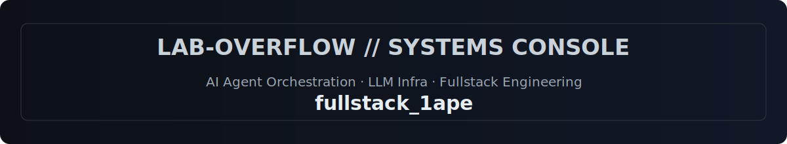
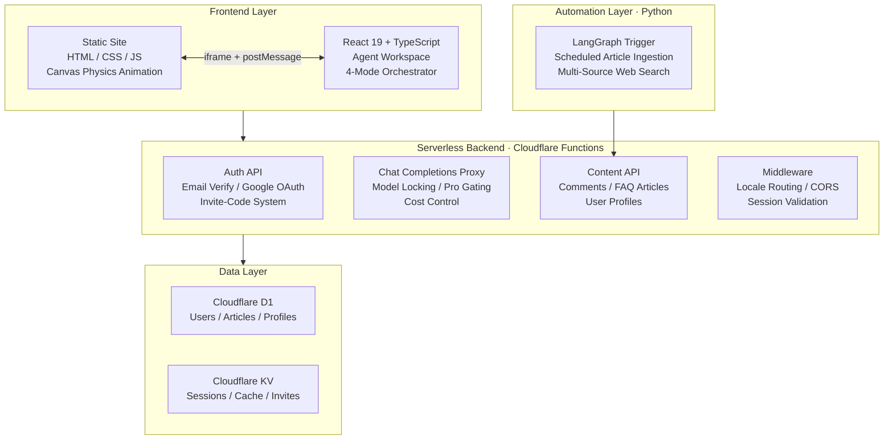
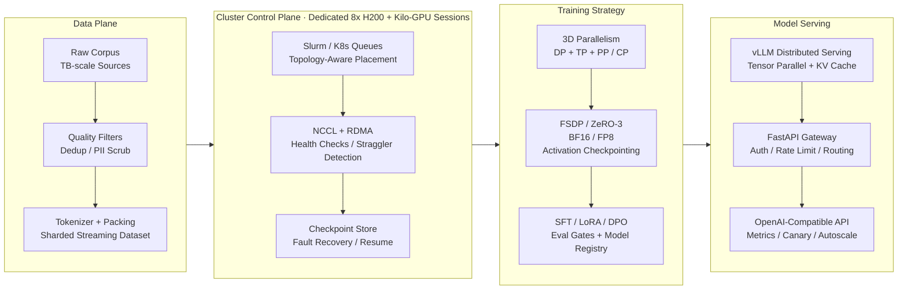

## Abstract

<!-- Animated ASCII / Terminal Intro (No Activity Metrics) -->

  

<!-- Tech Stack -->

  
   
  

---

## AI-Powered Calorie Calculator & Health Platform

  

  
  
  
  
  

A fullstack AI health platform independently designed, developed, and deployed — from 0 to 1, solo delivery.

**4 AI Agent Modes**
- `Combination Agent` — Select ingredients + cooking action, AI estimates resulting dish & calories via structured JSON output
- `Cooking Agent` — Autonomous agent: receives customer orders, plans cooking steps, executes 80+ tool-defined actions, manages real-time inventory
- `Verification Agent` — Semantic matching between served dish and original order with confidence scoring
- `Support Agent` — Context-aware Q&A for user guidance and methodology explanation

**Platform Architecture**

**Key Technical Highlights**
- **Serverless-Native Architecture** — Edge-deployed fullstack application with globally distributed low-latency access
- **AI Agent Orchestration** — Multi-mode agent system with recursive function calling, structured output enforcement, and real-time state management
- **Multi-Layer Auth & Access Control** — Email verification, OAuth integration, invite-code gating, and subscription-based feature access
- **Canvas Physics Engine** — Custom real-time 2D physics simulation with pointer-tracking interaction
- **Bilingual Intelligent Routing** — Automatic locale detection and content switching across the entire platform
- **LangGraph Automation Pipeline** — Scheduled multi-source data aggregation with automated content ingestion

  <a href="https://calculatorcaloriefree.com"><b>calculatorcaloriefree.com</b></a>

---

## AI Infra & Distributed Training

  
  
  
  
  
  
  

  <i>Dedicated access to an 8x H200 cluster for model engineering, with recurring participation in kilo-GPU training sessions: data quality, topology-aware scheduling, 3D parallel training, fault-tolerant checkpoints, and vLLM-based serving.</i>

---

## Top Projects

| Project | Description | Stars |
|:--|:--|:--|
| [prompt-optimizer-lite](https://github.com/Lab-Overflow/prompt-optimizer-lite) | Lightweight prompt optimization toolkit |  |

## Tech Focus

**AI Agent & Multi-Agent**
`LangChain` `LangGraph` `Dify` `MCP Protocol` `ReAct` `Function Calling` `Prompt Engineering` `Context Engineering` `Agentic Automation` `Multi-Agent Orchestration`

**RAG & Intelligent Query**
`Text2SQL` `NL2SQL` `NL2Data` `Vector Retrieval` `Hybrid Retrieval` `Query Rewrite` `Knowledge Base` `ETL Pipeline` `Structured Output` `JSON Schema`

**AI Infra & Model Engineering**
`PyTorch` `Transformers` `LoRA` `QLoRA` `SFT` `DPO` `DeepSpeed` `FSDP` `8x H200` `Kilo-GPU Training` `Distributed Training` `Mixed Precision` `Gradient Checkpointing` `vLLM` `OpenAI Compatible API` `Model Serving`

**Fullstack & DevOps**
`React` `TypeScript` `FastAPI` `Node.js` `Three.js` `WebGL` `MySQL` `Docker` `Kafka` `Nginx` `CI/CD` `GitHub Actions`
